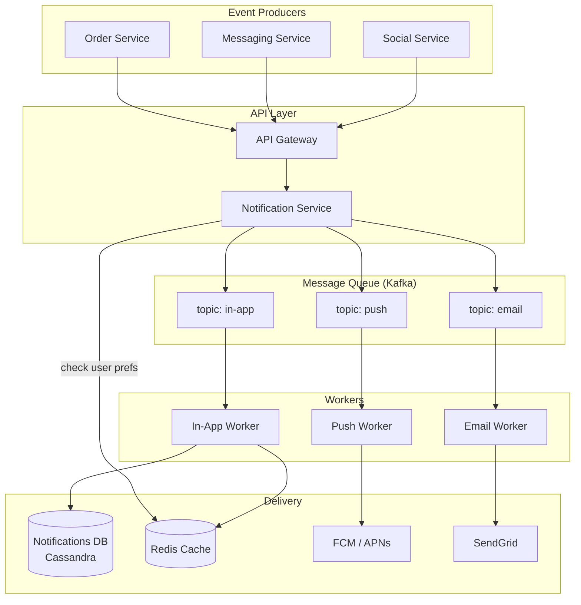
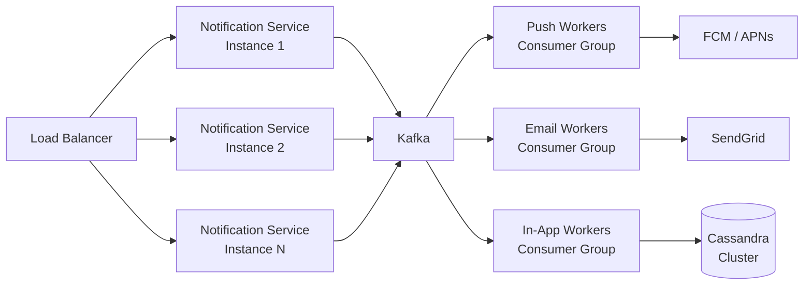
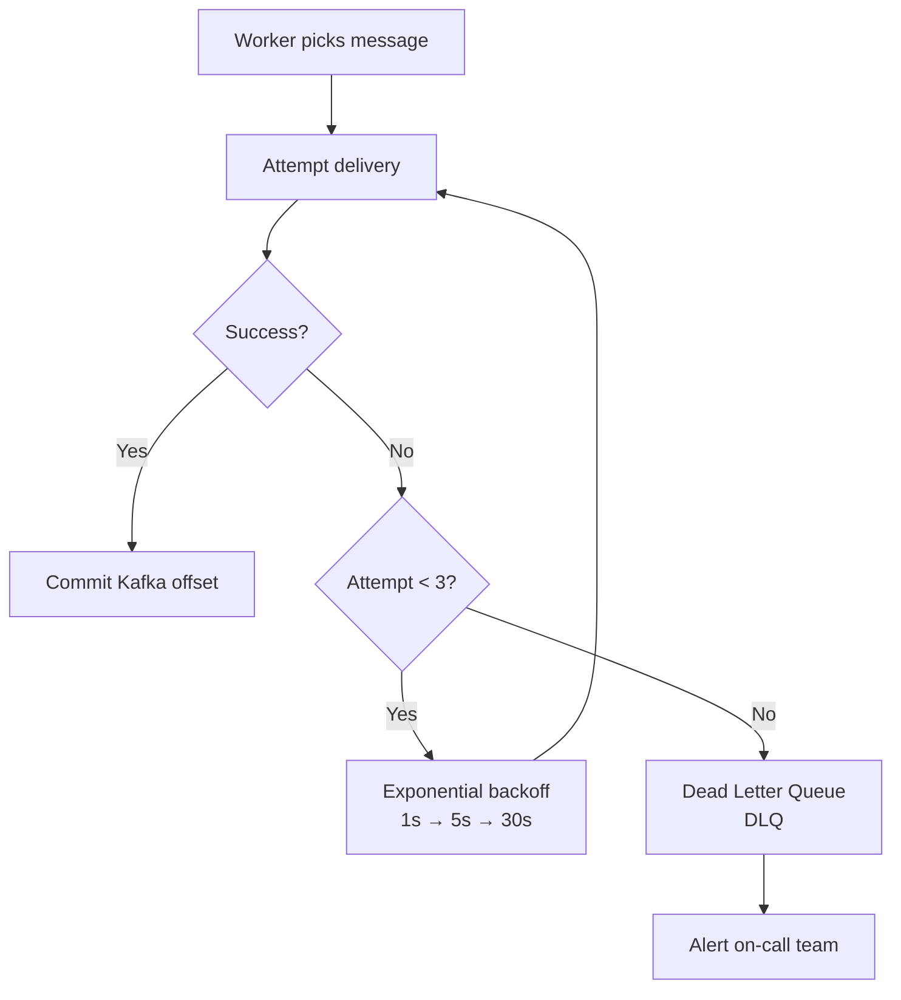

# Scalable Notification System

A system design for delivering 100 million notifications per day across in-app, push, and email channels — built for 20 million daily active users.

---

## Table of Contents

1. [Architecture Overview](#architecture-overview)
2. [API Design](#api-design)
3. [Data Model](#data-model)
4. [Scaling Strategy](#scaling-strategy)
5. [Reliability & Failure Handling](#reliability--failure-handling)
6. [Tradeoffs](#tradeoffs)

---

## Architecture Overview

The system is split into three logical layers:

- **API Layer** — receives notification requests from upstream services
- **Processing Layer** — a message queue consumed by channel-specific workers
- **Delivery Layer** — dispatches to in-app storage, push gateways (APNs/FCM), and email providers (SendGrid)



### Component Descriptions

| Component | Role |
|---|---|
| API Gateway | Rate limiting, auth, routing |
| Notification Service | Validates events, reads user preferences, fans out to Kafka topics |
| Kafka | Durable, high-throughput message queue; decouples producers from workers |
| Redis | Caches user preferences and deduplication keys (idempotency) |
| Workers | Consume Kafka topics; retry on failure |
| Cassandra | Stores in-app notifications; optimized for write-heavy workloads |
| FCM / APNs | Third-party push notification gateways |
| SendGrid | Third-party email delivery |

---

## API Design

### POST /notifications — Create a notification

**Request:**
```json
POST /v1/notifications
Content-Type: application/json

{
  "event_type": "order.shipped",
  "user_id": "usr_123",
  "channels": ["in_app", "push", "email"],
  "payload": {
    "title": "Your order has shipped",
    "body": "Order #456 is on its way!",
    "deep_link": "myapp://orders/456"
  },
  "idempotency_key": "evt_abc_20240401"
}
```

**Response:**
```json
HTTP 202 Accepted

{
  "notification_id": "ntf_789",
  "status": "queued",
  "created_at": "2024-04-01T10:00:00Z"
}
```

---

### GET /notifications/:user_id — Get in-app notifications

**Request:**
```
GET /v1/notifications/usr_123?limit=20&cursor=ntf_700&unread_only=true
```

**Response:**
```json
HTTP 200 OK

{
  "notifications": [
    {
      "notification_id": "ntf_789",
      "type": "order.shipped",
      "title": "Your order has shipped",
      "body": "Order #456 is on its way!",
      "is_read": false,
      "created_at": "2024-04-01T10:00:00Z"
    }
  ],
  "next_cursor": "ntf_780",
  "unread_count": 5
}
```

---

### PATCH /notifications/:notification_id — Mark as read

**Request:**
```json
PATCH /v1/notifications/ntf_789

{ "is_read": true }
```

**Response:**
```json
HTTP 200 OK

{ "notification_id": "ntf_789", "is_read": true }
```

---

### PUT /users/:user_id/preferences — Update notification preferences

**Request:**
```json
PUT /v1/users/usr_123/preferences

{
  "channels": {
    "push": true,
    "email": false,
    "in_app": true
  },
  "muted_event_types": ["marketing.promo"]
}
```

---

## Data Model

### notifications table (Cassandra)

Partitioned by `user_id` so all notifications for a user are co-located. Sorted by `created_at DESC` for efficient pagination.

```
notifications
─────────────────────────────────────────────
user_id          TEXT          (partition key)
created_at       TIMESTAMP     (clustering key, DESC)
notification_id  UUID
event_type       TEXT
channel          TEXT
title            TEXT
body             TEXT
is_read          BOOLEAN
deep_link        TEXT
expires_at       TIMESTAMP
```

**Index:** `(user_id, is_read)` — for fast unread count queries.

---

### user_preferences table (PostgreSQL)

```
user_preferences
─────────────────────────────────────────────
user_id               UUID   PRIMARY KEY
push_enabled          BOOL   DEFAULT true
email_enabled         BOOL   DEFAULT true
in_app_enabled        BOOL   DEFAULT true
muted_event_types     TEXT[]
updated_at            TIMESTAMP
```

**Cached in Redis** with TTL of 5 minutes — reads hit cache first, writes invalidate the key.

---

### notification_log table (PostgreSQL)

Used for deduplication and delivery auditing.

```
notification_log
─────────────────────────────────────────────
idempotency_key   TEXT        PRIMARY KEY
notification_id   UUID
user_id           UUID
channel           TEXT
status            TEXT        (queued | sent | failed | deduplicated)
attempt_count     INT
last_attempt_at   TIMESTAMP
created_at        TIMESTAMP
```

---

## Scaling Strategy

### Traffic estimates

| Metric | Value |
|---|---|
| DAU | 20 million |
| Notifications / day | 100 million |
| Average throughput | ~1,160 / second |
| Peak throughput (10× spike) | ~11,600 / second |

### Horizontal scaling



- **Notification Service** is stateless — scale horizontally behind a load balancer.
- **Kafka** partitioned by `user_id` — ensures ordering per user; add partitions for throughput.
- **Workers** are Kafka consumer groups — scale independently per channel.
- **Cassandra** shards by `user_id` hash — add nodes as data grows.

### Sharding

Cassandra's consistent hashing distributes `user_id` partitions across nodes automatically. No manual sharding needed. For PostgreSQL (`user_preferences`, `notification_log`), shard by `user_id % N` if the table grows beyond a single primary.

### Caching

- User preferences cached in Redis (TTL 5 min) — avoids DB hit on every notification.
- Unread counts cached per user — invalidated on new notification or read.

---

## Reliability & Failure Handling

### Retry strategy



- Workers retry up to **3 times** with exponential backoff.
- After 3 failures the message is routed to a **Dead Letter Queue (DLQ)**.
- DLQ messages are monitored; can be replayed manually after root cause is fixed.
- Kafka offsets are committed **only after successful delivery** — guarantees at-least-once delivery.

### Deduplication

Before enqueuing, the Notification Service writes the `idempotency_key` to Redis with a 24-hour TTL.

```
SET idempotency:{key}  "1"  EX 86400  NX
```

If the key already exists, the request is rejected as a duplicate. This protects against:
- Retried HTTP requests from producers
- Kafka consumer reprocessing after a crash

### Avoiding spam (Rate Limiting)

Per-user rate limits are enforced at the API Gateway and in the Notification Service using a sliding-window counter in Redis:

```
INCR rate:{user_id}:{channel}:{window}
EXPIRE rate:{user_id}:{channel}:{window} 3600
```

Default limits (configurable):
- Push: max 20/hour per user
- Email: max 5/hour per user
- In-app: max 100/hour per user

### High Availability

- Kafka: 3-broker cluster with replication factor 3.
- Cassandra: replication factor 3 across availability zones.
- Redis: Redis Sentinel (primary + 2 replicas) with automatic failover.
- All stateless services (API, workers) run in multiple instances across AZs.

---

## Tradeoffs

### 1. Async (queue) vs Sync delivery

**Chosen:** Async via Kafka.

Async decouples producers from delivery speed. A slow email provider doesn't block the order service. The tradeoff is **eventual delivery** — a notification may arrive seconds later than the triggering event. For most use cases (order shipped, new comment) this is acceptable. For truly time-critical messages (2FA codes), a synchronous fast-path could be added.

### 2. Push vs Pull for in-app notifications

**Chosen:** Pull (client polls via REST).

Pull is simpler to build and scale. The client requests unread notifications on app open or on a timer. The tradeoff is **slight staleness** — the user sees new notifications only when they poll. A hybrid approach (WebSocket or SSE for online users, poll fallback for offline) improves freshness but adds server-side connection management complexity.

### 3. Consistency vs Latency for user preferences

**Chosen:** Cache-first (eventual consistency).

Reading preferences from Redis on every notification is fast (~1ms). After a user updates preferences, the cache TTL (5 min) means they may still receive a notification type they just disabled. Strict consistency would require a synchronous DB read on every notification, adding ~10–20ms latency and putting more load on PostgreSQL at scale. The 5-minute eventual consistency window is an acceptable product tradeoff.

### 4. At-least-once vs Exactly-once delivery

**Chosen:** At-least-once (with deduplication).

Kafka guarantees at-least-once delivery by default. Exactly-once is possible but adds significant complexity (transactions, two-phase commits). Instead, idempotency keys in Redis handle deduplication on the consumer side, achieving a practical "effectively once" result at lower operational cost.

---

## Technology Summary

| Layer | Technology | Reason |
|---|---|---|
| API Gateway | Nginx / Kong | Rate limiting, auth |
| App Services | Node.js / Go | Stateless, horizontally scalable |
| Message Queue | Apache Kafka | High throughput, durable, replay |
| In-app storage | Cassandra | Write-heavy, time-series, scalable |
| Preferences / Logs | PostgreSQL | Relational, consistent |
| Cache | Redis | Sub-millisecond, TTL support |
| Push delivery | FCM + APNs | Industry standard |
| Email delivery | SendGrid | Managed deliverability |